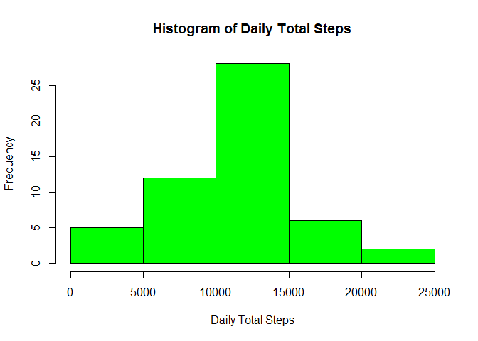
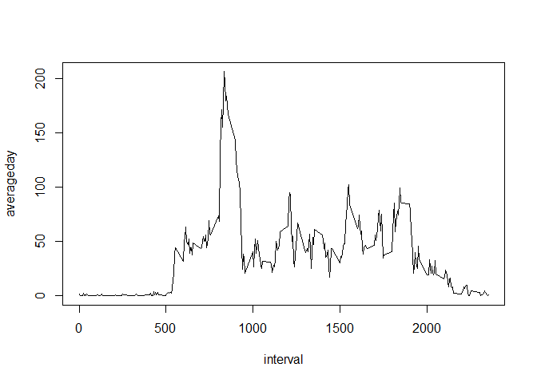
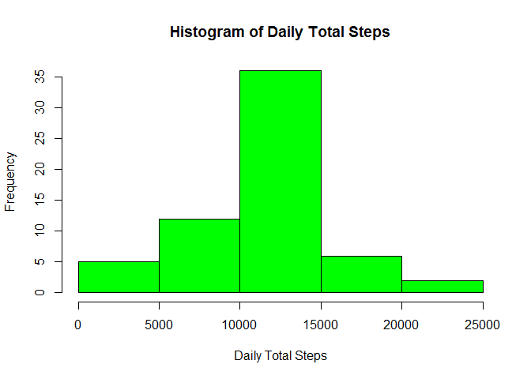
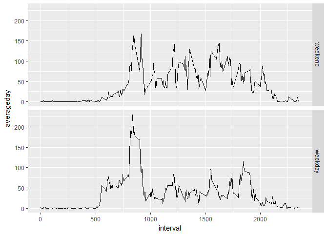

# Reproducible Research: Peer Assessment 1


## Loading and preprocessing the data

```r
library(dplyr)
```

```
## 
## Attaching package: 'dplyr'
```

```
## The following objects are masked from 'package:stats':
## 
##     filter, lag
```

```
## The following objects are masked from 'package:base':
## 
##     intersect, setdiff, setequal, union
```

```r
read.csv("activity.csv")->repdata
repdata[!is.na(repdata[,1]),]->repdata2
```

## What is mean total number of steps taken per day?

```r
repdata2 %>% group_by(date) %>% summarise(dailysum = sum(steps)) -> dailytotals
hist(dailytotals$dailysum, main = "Histogram of Daily Total Steps", xlab = "Daily Total Steps", col="green")
```

<!-- -->

```r
mean(dailytotals$dailysum)
```

```
## [1] 10766.19
```

```r
median(dailytotals$dailysum)
```

```
## [1] 10765
```

## What is the average daily activity pattern?

```r
repdata2 %>% group_by(interval) %>% summarise(averageday = mean(steps)) -> activity
plot(averageday~interval, data=activity, type="l")
```

<!-- -->

```r
activity[which.max(activity$averageday),]
```

```
## # A tibble: 1 × 2
##   interval averageday
##      <int>      <dbl>
## 1      835   206.1698
```

## Imputing missing values

```r
repdata[is.na(repdata[,1]),] %>% inner_join(activity, by="interval") %>% select(steps = averageday, date, interval) -> imputed
rbind(repdata2, imputed) -> repdata3
```


```r
repdata3 %>% group_by(date) %>% summarise(dailysum = sum(steps)) -> dailytotals
hist(dailytotals$dailysum, main = "Histogram of Daily Total Steps", xlab = "Daily Total Steps", col="green")
```

<!-- -->

```r
mean(dailytotals$dailysum)
```

```
## [1] 10766.19
```

```r
median(dailytotals$dailysum)
```

```
## [1] 10766.19
```
So, no, the mean and median were not significantly changed by imputation of missing data.

## Are there differences in activity patterns between weekdays and weekends?

```r
mutate(repdata3, weekpart = factor(weekdays(as.Date(as.character(repdata3[,2]))) %in% c("Sunday","Saturday"), levels = c(TRUE, FALSE), labels = c("weekend","weekday"))) ->repdata4

repdata4 %>% group_by(interval, weekpart) %>% summarise(averageday = mean(steps)) -> activity
library(ggplot2)
qplot(interval, averageday, facets = weekpart~., data = activity, geom="line")
```

<!-- -->

There is an interesting difference in this plot: The tall peak in the morning happens on weekdays, but on the weekends the peak is at the same level as the rest of the day.
